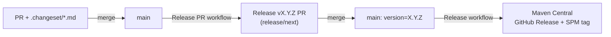

# Publishing

Wake ships via two independent channels from `.github/workflows/release.yml`:

- **Maven Central** — Android AAR, `kotlinMultiplatform` metadata, per-target klibs. For Gradle/KMP consumers.
- **GitHub Releases** (via KMMBridge) — the SKIE-enhanced `WakeKit.xcframework` zip. For pure-Swift SPM consumers.

## Maven Central

**Coordinates:** `com.happycodelucky.wake:wake`

One Gradle invocation publishes:

- The Android AAR.
- The `kotlinMultiplatform` metadata module (`.module` file) that ties every target together.
- Per-target klibs: `wake-iosarm64`, `wake-iossimulatorarm64`, `wake-macosarm64`, `wake-android`.
- Sources / javadoc jars next to each, with detached GPG signatures.

The test-fakes module publishes alongside it under `com.happycodelucky.wake:wake-testing`.

## Release pipeline

Releases are driven by **changesets**: each PR describes its change in a small
Markdown file, and the version and changelog are computed from them. Nobody
picks a version number by hand or runs a release workflow for a normal release.



1. **Every PR adds a changeset** — `mise run changeset` writes
   `.changeset/<branch>.md` with a `title`, a `change` level
   (`major`/`minor`/`patch` — the source of truth for the version, and the
   author's call) and a `description`, followed by the full note in Markdown in
   place of an *Unfilled* callout the check refuses to let through. The **Changeset** check (`changeset.yml`) fails a PR without one;
   label it `no-changeset` if nothing in it reaches consumers. Format and rules:
   [`.changeset/README.md`](../.changeset/README.md).
2. **One rolling release PR.** On every push to `main` with changesets
   pending, `release-pr.yml` rebuilds the `release/next` branch from `main` and
   opens or updates a **Release vX.Y.Z** PR. `scripts/changeset.py version`
   picks the version (the highest `change` level, bumped from `version=` in
   `gradle.properties`; while 0.x a `major` bumps the minor), rewrites
   `gradle.properties` and every version marked `x-release-version` (e.g. the
   README's install snippets), inserts the release into `CHANGELOG.md`, and
   deletes the consumed changesets. Later merges fold into the same PR.
3. **Merging the release PR publishes it.** Its version bump lands on `main`;
   `release.yml` sees `version=` change on a push to `main` and releases exactly
   that version — Maven Central first (irreversible), then the XCFramework to a
   GitHub Release plus the `vX.Y.Z` tag. `main` then *is* the release: its version, README and
   changelog already match what was published.

To leave 0.x (or pin any exact version), add `version: 1.0.0` to a
changeset's front matter.

### Pre-releases and retries (manual runs)

Run **Release** from the Actions tab (`workflow_dispatch`):

| `version` | Does |
|---|---|
| *(empty)* | Releases `gradle.properties`' version from `main` — retries a release that failed. |
| `0.4.0-rc.1` | A pre-release, from **any branch**. Marked pre-release on GitHub; notes are the changesets pending on that branch. |
| `0.4.0` | Must equal `gradle.properties`' version on `main` — stable versions come only from release PRs, so the changelog, `main` and Maven Central can't disagree. |

`dryRun` defaults to **true** for manual runs: it uploads to the Central Portal
staging area only (`publishToMavenCentral`). Review the deployment at
https://central.sonatype.com/ and click Publish (or Drop). Nothing is tagged
and no XCFramework is published. Merging a release PR is always a real
release.

**If a release fails part-way**, re-run the failed jobs from the Actions UI (a
re-run replays the same commit). The release job resumes: a version already on
Maven Central skips straight to the GitHub/SPM half; a version that already has
a GitHub Release is refused.

The `automaticRelease = false` flag in the publish convention plugin
(`gradle/plugins/…publish.gradle.kts`) is what makes dry-run behaviour correct.
Do not flip it without reading the comment there.

### One-time setup for the release PR

A push or PR made with the workflow's `GITHUB_TOKEN` triggers no other
workflows, so CI wouldn't run on the release PR by itself. Pick one:

- **Default (`GITHUB_TOKEN`)** — enable **Settings → Actions → General →
  Allow GitHub Actions to create and approve pull requests**. `release-pr.yml`
  then dispatches CI and the Changeset check on `release/next` itself; their
  results show on the PR.
- **GitHub App** — create an App with *Contents* and *Pull requests*
  read/write, install it on the repo, and set the `RELEASE_APP_CLIENT_ID`
  variable and `RELEASE_APP_PRIVATE_KEY` secret. The release PR is then
  authored by the App and CI triggers normally. (Prefer an App to a personal
  token: a PR opened as you can't be approved by you.)

If `main` requires status checks, add **Changeset** alongside CI's jobs.

## Credentials

The vanniktech plugin reads **four Gradle properties**. It doesn't care where they come from — Gradle resolves a property `foo` from a `-Pfoo=` flag, an `ORG_GRADLE_PROJECT_foo` env var, or a `gradle.properties` file (CLI → env → `~/.gradle` → project). That's why the same setup works in CI and locally.

| Property | What it is | Where to get it |
|---|---|---|
| `mavenCentralUsername` | Central Portal **token** username (not your login) | [central.sonatype.com](https://central.sonatype.com/) → Account → Generate User Token |
| `mavenCentralPassword` | Central Portal token password | same token |
| `signingInMemoryKey` | ASCII-armored **GPG private key** block | `gpg --armor --export-secret-keys <KEY_ID>` (the whole `-----BEGIN…END PGP PRIVATE KEY BLOCK-----`) |
| `signingInMemoryKeyPassword` | The GPG key's passphrase | what you set when creating the key |

Your GPG public key must be published to a keyserver Central checks (e.g. `gpg --keyserver keyserver.ubuntu.com --send-keys <KEY_ID>`), or Central rejects the signatures.

### CI

Set four secrets on the **`continuous-deployment` GitHub environment** (repo Settings → Environments → `continuous-deployment` → Secrets — *not* repository-scoped secrets; `release.yml` binds to that environment):

| GitHub secret | Maps to property |
|---|---|
| `MAVEN_CENTRAL_USERNAME` | `mavenCentralUsername` |
| `MAVEN_CENTRAL_PASSWORD` | `mavenCentralPassword` |
| `MAVEN_CENTRAL_SIGNING_KEY` | `signingInMemoryKey` |
| `MAVEN_CENTRAL_SIGNING_KEY_PASSWORD` | `signingInMemoryKeyPassword` |

`release.yml` exports them as `ORG_GRADLE_PROJECT_*` env vars, which Gradle maps onto the property names above.

These are the **same** values the other `com.happycodelucky` packages publish with — the Sonatype user token and GPG key are reused, not generated per repo. Environment secrets aren't shared between repos, so enter them once here. `MAVEN_CENTRAL_SIGNING_KEY` is the entire ASCII-armoured block, `BEGIN`/`END` lines included; GitHub's secret editor preserves newlines. First-time setup of the token and key: [One-time Maven Central setup](#one-time-maven-central-setup).

## SPM distribution — KMMBridge → GitHub Releases

Touchlab's KMMBridge publishes the Apple framework to pure-Swift SPM consumers. The pipeline (real publishes only, not dry-run):

1. Gradle builds an `XCFramework` with `iosArm64` + `iosSimulatorArm64` + `macosArm64` slices. No x86. SKIE-enhanced (`produceDistributableFramework()` emits `.swiftinterface` files required by Xcode 26).
2. KMMBridge zips the XCFramework and uploads it as a GitHub Release asset. GitHub *Releases*, not GitHub *Packages* — Packages requires a PAT to download even from public repos; Release assets are public and unauthenticated.
3. KMMBridge regenerates the root `Package.swift` referencing the asset by URL + sha256 checksum. The workflow rewrites KMMBridge's API asset URL to the public `releases/download/…` form, commits `Package.swift` on a detached **release commit**, and force-moves the version tag onto it so the tagged manifest matches the uploaded binary.
4. Swift consumers add this repo's URL as an SPM dependency pinned to a version tag; the tagged `Package.swift` hands them the prebuilt binary.

The release commit lives **only on its tag**. `main` is branch-protected (a bot
push is rejected) and doesn't need it: `main` keeps the `Package.swift` stub,
and a consumer pinned to
`branch: "main"` isn't a supported way to consume a binary target.

### Rules

- KMMBridge config lives in the `kmmbridge { }` block in `wake/build.gradle.kts`; the version pin lives in `gradle/libs.versions.toml`. Only `:wake` gets KMMBridge — `:wake-testing` ships klibs via Maven Central only.
- Do **not** redeclare `XCFramework("WakeKit")` in the `kotlin { }` block: KMMBridge auto-creates the aggregator tasks (`assembleWakeKit{Debug,Release}XCFramework`) at config time; a second declaration collides.
- Versioning: the release workflow passes `-Pversion=X.Y.Z` — `gradle.properties`' version, or a pre-release's — and KMMBridge tags `v${version}`. KMMBridge's own timestamp versioning is not used.
- Publishing is CI-only: the `kmmBridgePublish` task only exists when `-PENABLE_PUBLISHING=true` is passed (the release workflow does this).
- Don't vendor `XCFramework` zips into the repo. Everything flows through GitHub Release assets + the committed `Package.swift`.
- `Package.swift` on `main` is the committed stub; `kmmBridgePublish` writes the released form onto each tag's release commit, and `spmDevBuild` rewrites it for local development. Don't commit either rewrite (`mise run spm:restore`).

## Local XCFramework development

To try local Kotlin changes from an Xcode project, point it at this repo as a local package after `spm:dev`.

```bash
mise run spm:dev        # rebuild debug XCFramework + flip Package.swift to local path
mise run spm:restore    # restore the committed Package.swift
mise run build:xcframework  # rebuild release XCFramework without touching Package.swift
mise run publish:local  # publish to ~/.m2 as the next X.Y.Z-SNAPSHOT (never the released version)
```

The committed `Package.swift` is a stub; released versions resolve their remote-binary `Package.swift` from their `vX.Y.Z` tag.

## One-time Maven Central setup

These steps were done once when Maven Central publishing was first wired up.
Re-doing any of them is only needed for key / credential rotation or if the
namespace is ever moved.

### 1. Claim the namespace

1. Log in to <https://central.sonatype.com>.
2. **View Namespaces** → **Add Namespace** → enter `com.happycodelucky`.
3. Copy the **Verification Key** Sonatype shows.
4. Add a DNS TXT record at the apex of `happycodelucky.com`:
    - Name: `@` (or leave blank, depending on the registrar's UI)
    - Value: the verification key, verbatim
5. Wait for DNS propagation, then click **Verify Namespace** in the Portal.

> The `com.happycodelucky` namespace is shared across your other
> `com.happycodelucky` libraries (e.g. `reachable`), so it's almost certainly
> already verified — in which case skip this step.

### 2. Generate a Sonatype user token

The Central Portal login password is **not** what Gradle uploads with.

1. Portal → top-right avatar → **View Account** → **Generate User Token**.
2. Save both fields. Sonatype only shows the password once.
   - The username is short (~12 chars).
   - The password is longer (~24 chars).
3. These map to the `MAVEN_CENTRAL_USERNAME` and `MAVEN_CENTRAL_PASSWORD`
   GitHub secrets below.

### 3. Generate a GPG signing key

Central requires every artifact to be GPG-signed.

```bash
# 4096-bit RSA. Use a real email and a strong passphrase.
gpg --full-generate-key

# Grab the long key ID (16 hex chars after the rsa4096/ marker).
gpg --list-secret-keys --keyid-format=long

# Publish the public half so Central can verify signatures. Use hkps://
# (port 443 / HTTPS) — the legacy hkp:// port 11371 is firewalled on
# many networks. Belt-and-braces: push to all three.
gpg --keyserver hkps://keyserver.ubuntu.com --send-keys <LONG_KEY_ID>
gpg --keyserver hkps://keys.openpgp.org    --send-keys <LONG_KEY_ID>
gpg --keyserver hkps://pgp.mit.edu         --send-keys <LONG_KEY_ID>

# Export the SECRET key. This is the blob that goes into the GitHub
# secret. Delete the .asc file from disk once stored in GitHub.
gpg --armor --export-secret-keys <LONG_KEY_ID> > wake-signing.asc
```

After upload, confirm the key is findable by fingerprint:

```bash
gpg --keyserver hkps://keys.openpgp.org --recv-keys <LONG_KEY_ID>
```

Or in a browser: <https://keys.openpgp.org/search?q=YOUR_KEY_ID> — this is the
same lookup Sonatype performs at upload time.

**Quirk:** `keys.openpgp.org` strips the email address from uploaded keys until
you confirm via a verification link sent to that email. The cryptographic
material is uploaded regardless, so signature verification works fine — but the
key won't show up in email searches until you click the link.
`keyserver.ubuntu.com` and `pgp.mit.edu` don't strip emails.

> If you already generated a signing key for another `com.happycodelucky`
> library, reuse it — the same key signs every artifact under the namespace.

Then set the four values as described under [Credentials → CI](#ci).

## Rotating credentials

### Sonatype user token

If the token leaks or you want a fresh one, generate a new one in the Portal
(Step 2 above), then update `MAVEN_CENTRAL_USERNAME` and `MAVEN_CENTRAL_PASSWORD`
in the `continuous-deployment` environment secrets (and in your other packages'
repos, since each holds its own copy). The old token continues to work until you revoke it from the
Portal.

### GPG signing key

If the signing key leaks: generate a new key (Step 3 above), upload its public
half, then update `MAVEN_CENTRAL_SIGNING_KEY` and
`MAVEN_CENTRAL_SIGNING_KEY_PASSWORD` in the `continuous-deployment` environment
secrets (and in your other packages' repos that sign with the same key). Past releases signed with the old
key remain valid — keyservers retain the public half forever, so Central can
still verify their signatures. Future releases will be
signed with the new key.

You can also publish a revocation certificate for the old key if you generated
one with `gpg --gen-revoke` — that's a stronger signal than just leaving the key
dormant.
